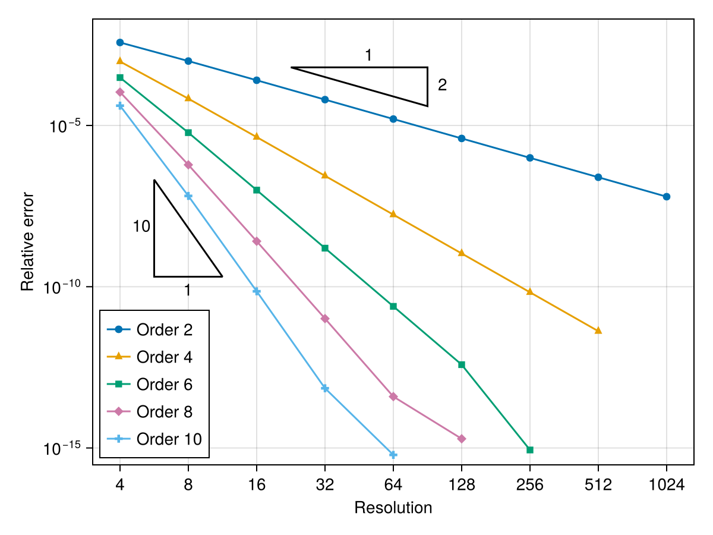

# 🌪️ Turbulox

[](https://agdestein.github.io/Turbulox.jl/stable/)
[](https://agdestein.github.io/Turbulox.jl/dev/)
[](https://github.com/agdestein/Turbulox.jl/actions/workflows/CI.yml?query=branch%3Amain)
[](https://codecov.io/gh/agdestein/Turbulox.jl)
[](https://github.com/JuliaTesting/Aqua.jl)

Turbulence in a box.

## 🚀 Installation

This package is in active development, and breaking changes are expected.
Install the latest version with

```julia
using Pkg
Pkg.add("https://github.com/agdestein/Turbulox.jl")
```

## 👮 The rules

You solve the incompressible Navier-Stokes equations with the following rules:

- The domain is always a cube $\Omega = [0,1]^d$ with $d \in \{ 2, 3\}$.
    Side length: $L = 1$.
- Annoying boundary conditions are forbidden (periodic box only).
- The flow is incompressible.
- The grid is uniform and staggered.
- There is no pressure 🥵.
- Single process, single GPU. Nowadays you can fit $1000^3$++ grid points on a single H100.

You get to choose:

- The resolution $n^d$
- The viscosity $\nu$ (but don't make it too large!)
- The dimension $d$
- The discretization order of accuracy $o \in \{2, 4, 6, \dots\}$
- Body force $f$

## ⚔️ The battle

🧙 Plug in your turbulence closure 🪄. Compete.

Todo:

- [ ] Leaderboard

## 📚 Down to business

The equations:

$$\partial_j u_j = 0$$

$$\partial_t u_i + \partial_j (u_i u_j) = -\partial_i p + \nu \partial_{jj} u_i + f_i$$

Discretization: Fully conservative combination of
central difference stencils from
[Morinishi et al.](https://www.sciencedirect.com/science/article/pii/S0021999198959629)

## 🫣 Outlook

Disretization orders:

- [x] Second order
- [x] Fourth order
- [x] Sixth order



Goodies:

- [ ] The velocity gradient and its waste products
    - [ ] Invariants
    - [ ] Turbulence statistics and scale numbers
- [ ] Spectra

Closure models:

- [ ] All the classics
- [ ] Nice interface for plugging in new ones

Differentiability

- [ ] Enzyme-compatibility

Data-generation

- [ ] Add batch dimension and loop over it in kernels (maybe)
- [ ] Data-consistency: Export commutator errors and sub-filter tensors consistent
    with how they appear in the discrete equations
